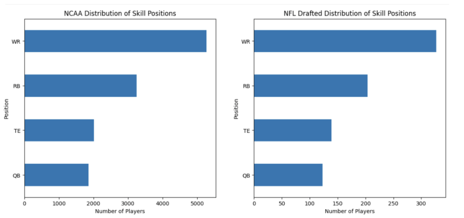
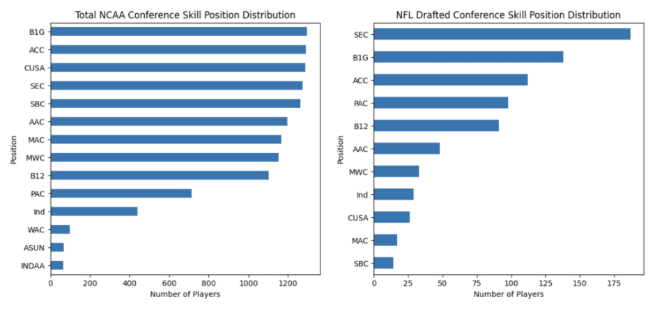
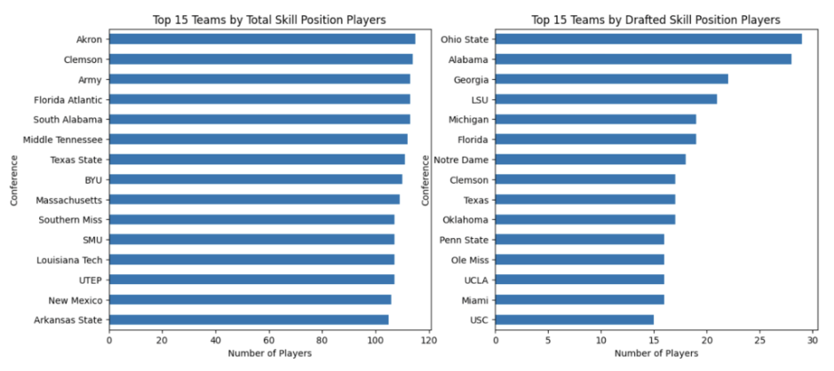
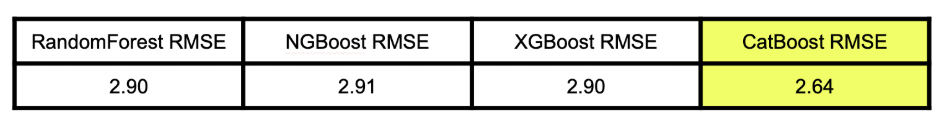
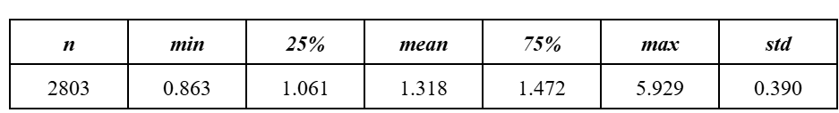
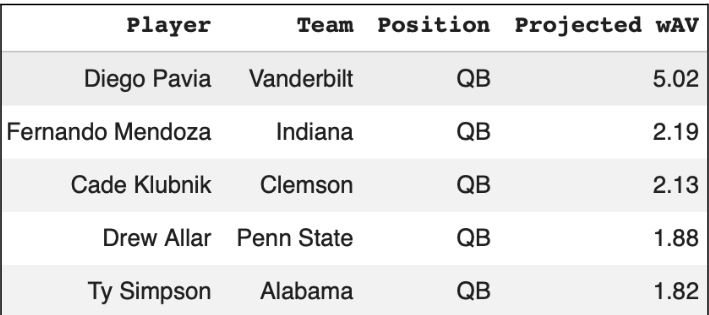
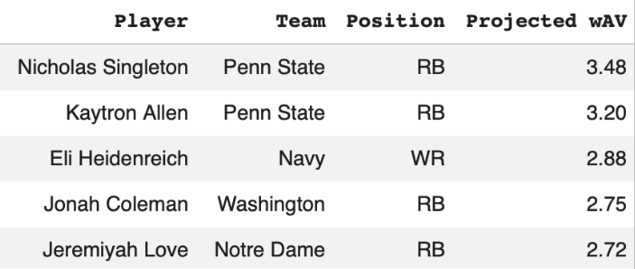
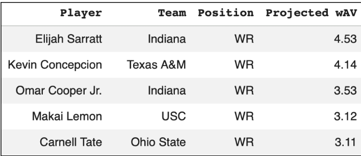
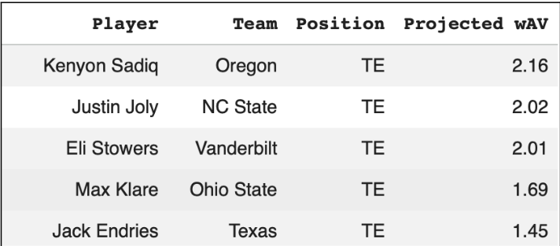

# NFL Draft Board: A Comprehensive Evaluation of What Makes Collegiate Football Players Successful in the NFL
**Team:** Nathan Backman (natekbackman) (POC), Chris Marfisi (ChrisMarfisi), Hunter Geise (HunterGeise), Dylan Stafeil (DylanStafeil1), Brett Cerenzio (bjcerenz)
## Introduction
The three-day NFL Draft is the one of the most critical days of the calendar year for NFL franchises because players selected can set up a team’s future for years to come or set them back for a long time. Many comparisons and eye-tests are used by front-offices and scouts to pick “their guy” in the draft, but every process has its flaws. In this project, we are predicting NFL career success of skill players (quarterbacks, running backs, wide receivers, and tight ends) in the upcoming draft by using collegiate data and former drafted players as reference points. This project would help solidify who the top players are, reducing noise in whether players A and B will have better careers than players C and D.

Our stakeholders in this project will be NFL front-offices and coaches, as well as any media outlets that make NFL Draft predictions. In the case of the front-offices and coaches, a successful project will help improve scouting departments and simplify draft-day decisions due to having an algorithm that shows which skill players can have the best careers. For media outlets, this impacts any analyst or personality that shares their mock drafts as the season comes to a close. These mock drafts influence the thoughts of fans and consumers across the globe, giving almost an insider’s thoughts on where the dominos will fall on draft night. 

In this new approach, we are using machine learning models on the collegiate data to create a Weighted Approximate Value (wAV) that values player success, then run a clustering model to compare players in the draft class and previously drafted players. We find these two models as the most optimal for this problem because they are better at separating hype around players, letting the numbers do the talking.

## Literature Review
Projecting the impact of amateur players in a professional setting has been a common idea addressed within the world of sport analytics over the last few years. The insights that result from these projects are generally seen as incredibly valuable for front office executives, coaches, and scouts alike, as it helps to provide a more efficient means of assessment on future draft prospects and can cut down significantly on time spent watching film.

Kitman Labs (2025) released work in which they outline two different models trained for each offensive skill position player in the NFL draft; one to predict the likelihood of a player being drafted in the first round, and one to predict whether a player will succeed in the NFL over multiple seasons. The goal in training both of these models was to highlight the gaps between metrics that are generally seen as indicators of success (driving the first model) versus metrics that are actually indicators of success (driving the second model) by using a combination of collegiate stats and draft combine results. The definition of “success” in the NFL, however, was not explicitly stated.[^1]

Czasonis et al. (2025) developed a metric called “Relevance-based Prediction” (RBP) for NBA draft prospects. This metric aimed to use historical information from previous draft prospects and their subsequent career trajectory in order to align with the information of current draft prospects as a means for forecasting the potential trajectory of their career. While this methodology was applied to NBA draft prospects, we felt the approach could be reproducible in the context of NFL draft grades.[^2]

A public GitHub project (Hauck 2023) outlined a methodology for projecting prospect success, defined as a metric called “Adjusted Approximate Value” (AAV) which is a stat meant to be an all-encompassing quantification of a player’s value towards their team’s success. This approach utilizes various data sources, from collegiate stats to public scouting grades for quarterbacks and wide receivers.[^3]

## Data
We will be utilizing data from the [collegefootballdata.com](https://collegefootballdata.com/) database & the [nflreadpy](https://github.com/nflverse/nflreadpy) package in Python. The collegefootballdata.com database which collects season level college football data going back to 2014 as well as draft information on each player. It collects advanced metrics such as average & total Predicted Points Added, which evaluates total number of points a player added to their offense, Usage Rate, which evaluates how often the player is utilized in the offense, & other basic box score statistics such as Passing Yards, Rushing Yards, TDs, etc. Variables are included in a glossary on the College Football Data webpage, and data is updated on a consistent basis to ensure up-to-date, accurate information. Nflreadpy will allow us to scrape draft data with player performance in the NFL, graded as [Weighted Approximate Value](https://www.pro-football-reference.com/about/approximate_value.htm), a measure created by pro-football-reference to evaluate & compare player performance across different positions with a single number. The ultimate goal is to join this draft data onto college football data’s draft data based on year, name, position, & pick number, which will then allow us to join on player id for the usage & predicted points added tables. Currently, a merged dataframe of usage and predicted points added statistics has over 27,000 rows & roughly 30 columns after filtering for D1 players.

After evaluating the amount of nulls in the data, we were able to see that many of the high null percentage variables had some sort of involvement with players who were drafted. Variables consisted of draft information such as team, pick, and round to events that players are evaluated on at the NFL Combine - bench (bench press), cone (three-cone drill), shuttle (shuttle run), broad_jump, forty (40-yard dash time), and vertical (vertical jump). In these instances, almost all of the players that attend the combine get drafted, which is a small percentage of the data, and at the same time not all drafted players attended the combine or competed in all events. Other nulls were position specific, such as passing_TD and passing_YDS for quarterbacks or rushing_YDS for running backs and some wide receivers if they ever had a carry. It is a rare occurrence when you see a running back, wide receiver, or tight end complete a pass. The same will go for quarterbacks recording a reception

In the next few code chunks, we will start to get an idea of how the distribution of the data will shape up by looking at the overall data of skill position players (quarterbacks, runningbacks, wide receivers, and tight ends) alongside the skill players who were NFL draft picks. In our first plot, we are looking at the distribution of these skill position players.

We see in both plots that the wide receiver position has the highest amount and quarterback has the lowest, which intuitively makes sense. In a given football game, a team will most likely have one quarterback, one or two runningbacks, two or three receivers, and one or two tight ends (each of these values are dependent on the formation the team is using). Therefore, some top teams will have multiple runningbacks, wide receivers, or tight ends selected within the same draft. Wide receivers happen to outnumber the other positions because historically, it is more likely that there are drafts where two or three wide receivers from the same school are drafted than two running backs or two tight ends. The same idea applies to quarterbacks, where only one quarterback will be on the field (unless there is a trick play or committee). Therefore a school would only have one quarterback drafted.
Our next plot looks at the breakdown of total skill position players by conference.

Here, we see a huge difference in the amount of skill position players by conference. These numbers are first heavily affected by how many teams are in a conference. More teams means there will be more skill players used. Other factors like if a game is a blow out will influence how many skill players get in, where more bench players will see garbage time minutes they usually do not. Towards the top of the distribution, we see a mix of power conferences and smaller conferences. Before conference realignment the SEC, Big 10, ACC, PAC-12, and Big 12 were known as the Power 5 because they had the most talent and would dominate all other conferences.

When looking at the drafted barplot, we see a huge discrepancy in talent. The SEC, Big 10, ACC, PAC-12, and Big 12 are the top five teams. The SEC leads the way because "it means more in the South". In the timeframe of 2014-2025, you have Alabama, Georgia, LSU, and Florida being SEC powers that were towards the top of the rankings and produced large amounts of NFL skill players. All of the top high school recruits would commit to the top SEC schools because it was their best chance to make it to the pros. The Big 10 comes in behind with top skill producers like Ohio State, Michigan, and Penn State, producing NFL talent each year. Many think the Big 10 were the next best behind the SEC because of Ohio State being in the championship conversation every year and it had more depth than the other conferences. The ACC, PAC-12, and Big 12 round out the rest of the top five with schools like Clemson, Oregon, and Oklahoma carrying each of the respective conferences over this time frame. One other note is the Independents near the bottom, which is led by Notre Dame being a national powerhouse each year. Connecticut produces a few players but in this age there are less than five independent schools in Division 1 football.

Our next plot breaks down these conferences to see which schools produce the most NFL skill players.

In this plot, we see the effects of how some of the smaller conferences managed to be near the top of the total players plot. Here, Clemson is the only power conference schools to show up in the top 15 by total players in a given year. During this time frame, Clemson was dominant. As mentioned in the conference plot above, more blowout games lead to more playing time for skill position players who usually never see the field.

When looking at the drafted plot, we see Ohio State and Alabama far ahead of the pack. These two schools are notorious for producing the best wide receiver prospects each year, as well as some top runningbacks. Going back to the last plot, we see Alabama (#2), Georgia (#3), LSU (#4), and Florida all represent the SEC in the top ten, the clear driving factor to their success. The one surprising school here is UCLA because they did not have a period of dominance unlike the rest of the school in this plot, whether it played in a top tier bowl game or made it to the College Football Playoff.

## Methods
There were three primary sections of our process: data preparation/collection, preprocessing, and modeling. The packages we used primarily consist of pandas, numpy, sci-kit learn, matplotlib, scipy, seaborn, umap-learn, and then all the individual packages for all the models we tested. 

We filtered the data to only include skill position players which consist of quarterbacks, runningbacks, wide receivers, and tight ends. Given that we were working with some pretty NA-heavy data, we used some imputation techniques to account for the missingness. For counting statistics, like passing attempts or rushing yards, missing values were filled with zeros, as their absence logically indicates no recorded activity. For remaining numeric features, we compared two imputation strategies: a KNN Imputer, which estimates missing values using the nearest neighbors in feature space, and a Simple Imputer using mean substitution. We then applied sklearn's StandardScaler to ensure equal weighting across all features.
Prior to modeling, we conducted PCA (Principal Component Analysis) to better understand the structure of the data and evaluate our imputation choices. Using a scree plot and cumulative variance threshold of 90%, we identified the number of components needed to represent the data adequately. When missing rows were simply dropped, roughly 7 components reached the 90% threshold; with mean imputation, slightly more components were required. Across both strategies, the top features driving PC1 consistently included total PPA (Predicted Points Added) on standard downs and first downs as well as receiving yards, receiving touchdowns, and receiving receptions. Features that focused on usage became more prominent under imputation. This PCA step helped identify which features were truly relevant to the problem before passing data into the regression models.

We approached the problem through the lens of regression to predict wAV (Weighted Approximate Value), a metric that quantifies a player’s total career contribution. We compared 4 different algorithms: Random Forest, XGBoost, NGBoost, and CatBoost. Additionally, to account for wAV being a cumulative statistic, players drafted earlier would accumulate higher values due to playing more years, so we adjusted wAV into a rate stat by dividing it by the number of seasons the player recorded. Going back to the modeling, for CatBoost specifically, we used Optuna for Bayesian hyperparameter optimization, with a search grid for optimization across the hyperparameters of iterations, tree depth, learning rate, L2 leaf regularization, bagging temperature, and Tweedie variance power. CatBoost's ability to handle categorical features like position meant no manual encoding was required. After the entire comparison process was completed, CatBoost came out as the strongest model, achieving the lowest RMSE. The final model was trained with a Tweedie loss function to better accommodate the skewed, non-negative nature of wAV and this model was used to predict wAV across all rankings for all skill positions, generating separate leaderboards for QBs, RBs, WRs, and TEs.

To summarize, we processed the data to only include skills positions, then normalized and imputed the data. We then ran PCA, to select only the most important features for our 4 model comparison test, in which the best performing model was CatBoost. We ran some hyperparameter tuning as well within this test, and our output were wAV rankings for each position group.

## Supporting Files
[Supporting Files](../work)

In the work folder, all of our necessary code files can be found. The following outlines the purpose and what was completed in each Python notebook:
1. CollegeFootballData.ipynb and nflreadpy.ipynb are the notebooks used to collect all of our data used, which were collected from CollegeFootballData.com and the nflreadpy package.
2. merge.ipynb was the notebook used to merge both data sets collected so we can have one complete data set as well as some data cleaning.
3. data_exploration.ipynb contains the code that was used to identify the amount of NA data points in each column as well as make visualizations to explore early trends in our data.
4. Principal_Component_Analysis.ipynb and pca_biplot.ipynb focus on reducing dimensionality in our data set and visualizing the trends in our simplified principal components.
5. Initial_Modeling_IST_707_Final_Project.ipynb and gmm_model.ipynb are the two files that contain all the models and results that were used in our final analysis.

## Results
We performed 10 fold cross-validation (CV) hyperparameter tuning on our four base models with 11 component PCA across numerous numeric variables as explained above and 2 categorical variables: position & college conference. Different positions have different responsibilities on the field, so this will change how each PCA component will impact their overall performance in the NFL. For instance, PCA components that highlight passing stats are going to be more important for QBs, while those containing receiving stats are going to pertain more to WR & TE. Including college conferences allows the model to account for competition level, as players in the top conferences (ie the SEC & Big 10), are naturally going up against better players. This allows the model to identify that a player with 1000 receiving yards on a Big 10 team is much more impressive than a player with 1000 receiving yards on an Ivy League team because the opponents a Big 10 team plays is much better. 

When testing across the four models, CatBoost clearly gave the best model, with an RMSE of 2.64, while the other models had RMSEs close to 2.90. 

In the table above, we see the distribution of model predictions on college players for the 2025 season, some of which were eligible for the 2026 NFL Draft. Naturally, we expect the majority of them to not provide much value at the NFL level. There are 257 picks in the 2026 NFL draft, and there are 2800 players who played in 2026 at QB, RB, WR & TE. That 2800 is also not including the other positions that we excluded in our analysis (Offensive Lineman & Defense). Even if every pick was used on QB, RB, WR, & TE in the 2026 NFL draft, only 9% of players would be drafted from our dataset. In the 2026 Draft, 80 players were selected among those 4 positions. That means that 31% of the draft picks were used on one of those 4 positions & only 2.9% of players from the 2026 season were selected in the draft.

These were our top 5 QBs who were available in the 2026 NFL Draft. Our model ranks Diego Pavia as the clear best QB in the 2026 Draft, followed by Fernando Mendoza & Cade Klubnik. Diego Pavia dominated in college, ultimately racking up over 10,000 passing yards, including 29 touchdowns (TDs) & a 70% completion rate in his senior year, where he was ultimately named the runner up for the Heisman Trophy (given to the best player in college football). Ultimately, teams passed on him during the draft because of character size/height concerns, both variables that we did not include in our model. Fernando Mendoza was the consensus number 1 pick in this year’s draft. He led the Indiana Hoosiers to their first College Football National Championship, throwing for 3500 yds, 41 TDS, & was named the Heisman Trophy winner last season.

These were our top 5 RBs who were available in the 2026 NFL Draft. The top two according to our model both come from Penn State, who employed a committee back system that saw both players get ample playing time throughout their 4 years at the school. Singleton has shown potential in college as an adequate rusher, but has really excelled at receiving out of the backfield. He was extremely talented in passing situations averaging 9.7 yards per reception, well above average compared to other running backs. Kaytron Allen, on the other hand, was an extremely capable rusher who racked up over 4,000 rushing yards in his 4 year career including multiple 1100 rushing yard seasons over his final 2 years. 

These were our top 5 WRs in the 2026 Draft. We have two more players from Indiana in Elijah Sarratt and Omar Cooper Jr., who along with Fernando Mendoza won the College Football National Championship just this past season. Saratt put together an extremely impressive two seasons with Indiana, accumulating over 1700 receiving yards the past 2 seasons & led college football with 15 receiving TDs in 2025. Kevin “KC” Concepcion, transferred from NC State to Texas A&M in 2025 and immediately made an impact for them. He tallied 919 receiving yards on 61 receptions & a conference leading 9 receiving TDs, leading them to a College Football Playoff appearance.

These were our top 5 TEs in the 2026 Draft. TEs are a little harder to project because blocking is also a factor in their repertoire, but here we only projected their receiving capabilities, which happens to be their main job. Kenyon Sadiq has an extremely athletic frame for a TE, and in his final season with Oregon, he tallied 560 receiving yards & 8 TDs. Justin Joly is another athletic TE who was converted from WR to TE. He tallied 1150 receiving yards in his last 2 seasons at NC State as well as 7 receiving TDs in 2025.

## Discussion
With the exception of Diego Pavia, who went undrafted, all of the players in our leaderboards were drafted in the NFL Draft, so we are happy with the players we predicted to have the most NFL success. However, there are certainly areas in which our models could improve. It is impossible to know for sure how right or wrong our model is (Diego Pavia could be the next Tom Brady), but there are patterns in our results that show clear weaknesses of the model. The model heavily favors players who had multiple great seasons of college football, and more importantly and more devastatingly, knocked players for having injury-shortened seasons or seasons where they hardly played. For QB’s, our top two players, by far, were Pavia and Trinidad Chambliss, who ended up going back to college for one more year. Pavia played junior college for two years, before having two great years at New Mexico State and two more at Vanderbilt, meanwhile Chambliss played four years for Division II Ferris State, before transferring to Ole Miss and having an extremely productive season. Both of these players spent their early years playing at levels that were not included in our data, and this greatly helped their performance in the model. Meanwhile, Fernando Mendoza, the number one pick in the NFL Draft, and Ty Simpson, the 13th pick, both spent their entire collegiate careers at FBS schools, and spent their early careers as backup quarterbacks (especially Simpson, who spent three years as a backup at Alabama before finally starting, and playing very well, in his fourth season). This means that they have multiple seasons in our data where they hardly put up any stats, and this hurt their performance in the model. For RB’s and WR’s, it is the same story. Our top RB’s, Nick Singleton and Kaytron Allen, both were mid-round draft picks, but they were four-year starters at Penn State, so they did well in our model. Meanwhile, Jeremiyah Love, the 3rd pick in the draft, was our 5th-ranked RB, largely because of a 385-yard freshman year where he was Notre Dame’s backup RB. Elijah Sarratt, our number one WR, played three years at the FBS level and was a very productive starter for all three years. Sarratt was drafted in the fourth round, the 19th WR picked in the draft, largely because of concerns about his ability to translate to the NFL. 4 of the 5 WR’s drafted in the first round (Tate, Lemon, Concepcion, and Cooper) were on our leaderboard. Tate, the 4th overall pick, and the first WR taken, is there despite him never being the number one WR on his team. This was not because of a lack of ability on Tate’s part, though, and more because he played with even better WR’s, like Marvin Harrison Jr, who went 4th overall in the 2024 Draft, and Jeremiah Smith, who will likely go in the top 4 of next year’s draft. Jordyn Tyson, the 8th pick in the draft, was not on the leaderboard because of two injury-plagued seasons. For TE’s, there was an overall lack of consistent production among players, and Sadiq, despite having only 24 yards as a freshman, still topped the list.

In terms of our stakeholder goals, we are close to providing a great stat for how college production impacts NFL success that improves scouting accuracy and simplify draft-day decisions, we just need to tweak our model a little. Changing how we calculate the weighted average (i.e. punishing players less for injury-riddled seasons and seasons where they were backups or weighing a player’s best season more heavily), would likely fix a lot of these issues and not allow for players who played the majority of their careers at lower levels that we do not have data for, or stat accumulators who started, and played well, for multiple years, but never put up the single-season numbers that other players did, to dominate our leaderboards. Overall, we feel like this is a good starting point for satisfying our stakeholder needs, but that the model needs some tweaking to make it truly useful and meaningful. Additionally, our model currently incorporates only one of the four main factors that goes into teams’ draft boards, that being college production. It does not factor in athleticism and measurements, tape, or personality and mentality, and while the last two are hard to quantify, athleticism and measurements could definitely be incorporated into our model to make it more all-encompassing.

## Limitations
During the completion of our analysis, we came across a few shortcomings and issues that affected our results. First, we realized that counting stats do not always lead to players having high draft stocks. Stats are very important when evaluating a player, but they do not tell the whole story. NFL scouting departments exist to pick up on traits that are not shown in stats. The value of a player is heavily dependent on the thoughts of these scouts and coaching staffs, a highly subjective evaluation, but the tape should prove why you should get drafted. Along with film analysis, teams rely heavily on age and potential of a player rather than focusing directly on stats. With age, teams want to find a good balance of a player who has played on the biggest stages and has experience, while also being fairly young so they can have more time to develop and hopefully retain the player for a long time. Think of it intuitively, you would want a great player who can be on your team as long as possible. Looking at potential, it is often dependent on the situation a team is in and how they feel a player is in their development. Most frequently, teams either play it safe with a high floor-low ceiling player (someone who will at least be a solid piece but never be a superstar) or a low floor-high ceiling player (someone who could be one of the best in the game but has the same chance of being out of the league in a few years because he was not good). If teams are in a win-now mode, they make focus on trying to find some solid pieces to bolster their top tier roster. In later rounds of the draft, teams may shift their focus on selecting some of the high ceiling players for the chance they turn into a great player, but also know they can get released before the season starts. Based on the models we ran, it was difficult to encapsulate these thoughts that front offices and coaches stakeholders have to deal with. Their decisions rely heavily on the eye test and the model does not reflect anything of that nature. 

Our second limitation was our feature selection, both with the features we chose & how we decided to aggregate across seasons. Although we utilized PCA analysis to include over 40 metrics into our model, different positions have different skillsets & requirements and this caused PCA to combine metrics that tell vastly different stories that may not be relevant across positions. However, without PCA analysis, deciding which metrics to exclude from the model was difficult & would require further research to determine which metrics are most correlated with NFL success. Including raw variables would also make the model much easier to interpret, making our model much more actionable for front office members. 

Lastly, our final limitation was that our model had difficulty projecting positive outliers, which we identified as superstars. In our top-five draft eligible player tables above, we saw only two players have a projected weighted approximate value (wAV) above four - Diego Pavia (QB, 5.02 wAV) and Elijiah Sarratt (WR, 4.53 wAV). Pavia had a very strong college career, but had some height and character concerns which led to him going undrafted. Similar to Pavia, Sarratt also had a very strong college career, capped off with a National Championship, but he was drafted with the 115th overall pick in the fourth round. Because the model was so focused on counting stats, the first overall pick Fernando Mendoza (QB, 2.19 wAV) was projected lower because his entire college career was not great, but he had a sensational senior season. Meanwhile, Nick Singleton and Kaytron Allen were our top two projected running backs because they were both four-year starters at Penn State, but did not go until the fifth round and later. Yet, Jeremiah Love was our fifth best running back and he went third overall in the draft. 

## Future Work
As mentioned previously, this model can be improved upon and the clearest starting point is in how the college seasons are being reflected in the data. While our weighted average approach was sound in theory, a more nuanced approach needs to be applied in order to address the nature of missed time for top prospects. On top of this, model performance can also be improved by removing PCA from the data pre-processing step, exposing the model to learning patterns between more than fifty different features. Doing so would also help with downstream interpretation. 

Model architecture could also see improvement through the use of a different training label, or even separate training labels for each skill position (i.e. QBR or Passer Rating for Quarterbacks). While wAV was sufficient for quantifying a player’s impact across their career, understanding the nuances of that overall impact is something that should be dissected and explored to further inform decision making. As such, training projection models on metrics that correlate more closely with season-level performance could give a sense of players that may hit the ground running when they enter the league versus guys that might see less playing time to start out and are potentially viewed more as “long-term projects.”

Our model can also be further adapted to meet the needs of our stakeholders by incorporating an understanding of offensive schemes. A team’s playbook is only as good as the personnel that are available to run it, so understanding various player archetypes or being able to highlight specific strengths can help with providing more insight into potential schematic fits for players and teams alike. Understanding what a team’s needs are can help weight the value of different draft picks, resulting in an algorithm that can adapt to stakeholder needs. In addressing these changes, we envision our draft projection model as being a vital tool for understanding and capitalizing on the value of an NFL draft pick.

## Work Assignments
The data acquisition was largely completed by Brett, Hunter, and Dylan along with some smaller contributions from the entire team. This consisted of scraping the football data, identifying the variables for prediction, the complicated merge of datasets, and initial exploratory analysis. 

The data preparation was completed by Chris and Brett. This consisted of dropping unnecessary columns, scaling data through Standard Scaling, PCA, a Simple Imputer PCA, a KNN Imputed PCA, and a UMAP visualization of the outcomes.

The modeling section was a joint effort by Brett and Nathan with a small contribution from Chris. This created baseline models to compare which were Random Forest, NGBoost, XGBoost, and CatBoost. Additionally, this section consisted of a Ward’s HAC attempt and a GMM clustering model to cluster quarterbacks. There was also some hyperparameter tuning to optimize the models. 

The Complete Analysis and Presentation section was completed by the team as a whole. This consisted of comprehensive test set evaluation, feature importance analysis, interactive map visualization, and final documentation. 

The worklog and workplan was largely completed by Hunter and Brett, with some smaller contributions from the entire team. This consisted of adding entries and sections to each once something was completed.

## References
[^1]: Kitman Labs. “Predicting NFL Draft Success Using Machine Learning.” 2025.

[^2]: Czasonis, N., et al. “Relevance-Based Prediction for NBA Draft Prospects.” 2025

[^3]: Hauck, J. “Projecting NFL Prospect Success Using Adjusted Approximate Value.” GitHub repository, 2023.
